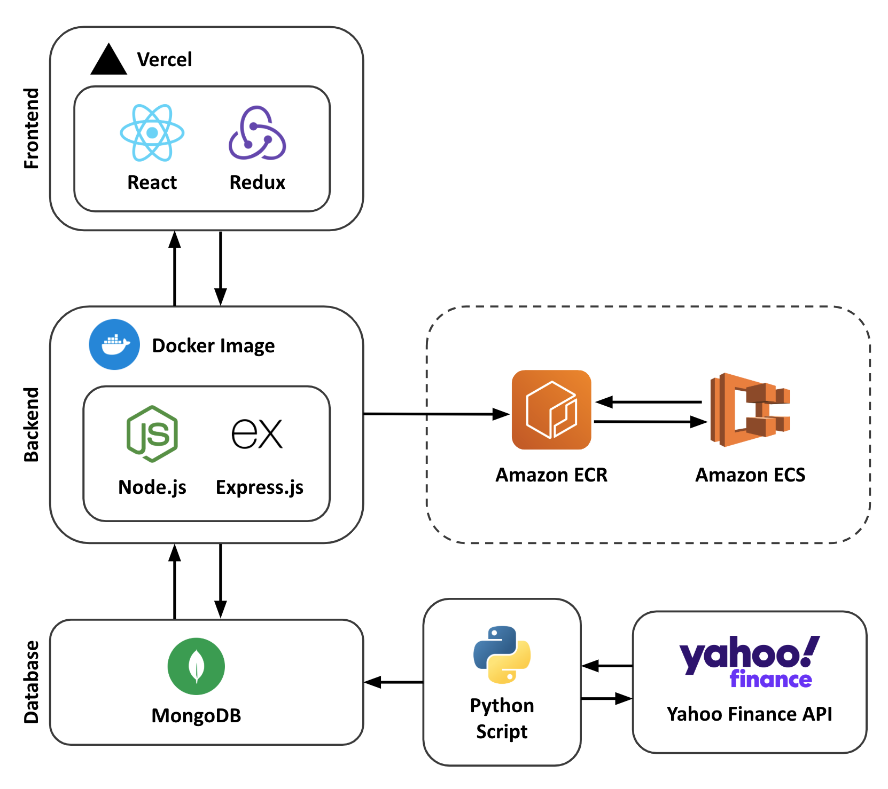

# Stockle 📈

[Stockle.ca](https://www.stockle.ca/) is a stock market-themed spinoff of the classic [Wordle](https://www.nytimes.com/games/wordle/index.html) game. In Stockle, players are challenged to guess a randomly chosen stock from a curated list. Players have 6 attempts to identify the correct stock based on clues provided after each incorrect guess. The clues include information about the stock's sector, share price, market cap, etc. Test your market knowledge and strategic thinking—can you crack the code and guess the stock in 6 tries?

https://github.com/user-attachments/assets/0b1065cd-d81d-41dd-9a1c-15b00512ab1c

## Tech Stack 🥞

### Frontend


### Backend


### Deployment


### System Architecture



## Development 🏗️

- Built a robust backend with `Node.js`, `Express.js`, and `MongoDB`, with endpoints for stock data and user administration
- Wrote a `Python` script to process CSV files of NASDAQ and NYSE tickers, filtering out indices, ETFs, small-cap stocks, and cross-listed stocks; fetches historical data using `yfinance` and stores it in `MongoDB` with `pymongo`
- Implemented a secure token-based user authentication with `JWT` and `bcrypt`, with login, signup, and guest play options
- Developed a responsive and modular single page app with `React` and `MUI`, featuring interative stock and bar charts with `Chart.js`
- Refactored `React` state components to adopt a Flux architecture with `Redux`, along with custom hooks for game logic and state management
- Utilized `Docker` and `Docker Compose` for streamlined development and deployment
- Deployed `React` app with `Vercel` and pushed a `Node`-based `Docker` image to `AWS ECR` to pull and deploy on `AWS ECS`, which uses a single `AWS EC2` instance and load balancer

## Installation 🖥️

Follow these steps to set up and run the project locally with [Docker Compose](https://docs.docker.com/compose/).

1. **Prerequisites:**
   Before you begin, ensure you have the following installed:

   - [Git](https://git-scm.com/book/en/v2/Getting-Started-Installing-Git)
   - [Docker Desktop](https://www.docker.com/products/docker-desktop/)

2. **Clone the Repository:**
   Start by cloning the repository to your local machine:

   ```
   git clone git@github.com:landont168/stockle.git
   cd stockle
   ```

3. **Environment Variables:**
   Set up the environment variables by creating a `.env` file in the root of the backend directory:

   ```
   PORT=4000
   MONGODB_URI=mongodb+srv://<username>:<password>@<cluster-url>/<database>?retryWrites=true&w=majority
   SECRET=<secret>
   ```

4. **Run Python script:**
   To fetch and store historical data from yfinance for the curated stocks in MongoDB, you must run a Python script within a virtual environment (Runtime: ~ 10 minutes).

   1. Create and active a virtual environment:

      ```
      cd backend/scripts
      python -m venv venv
      source venv/bin/activate
      ```

   2. Install the required dependencies:

      ```
      pip install -r requirements.txt
      ```

   3. Run the Python script:

      ```
      python get_stock_data.py
      ```

   4. Deactivate the virtual environment:

      ```
      deactivate
      ```

5. **Run with Docker Compose:**
   With Docker and Docker Compose, you can run the entire application with a single command to access the application at http://localhost:5173.

   1. Build and start the containers:

      ```
      docker-compose up --build
      ```

   2. Stop the containers:

      ```
      docker-compose down
      ```

## Acknowledgments 📚

- [Full Stack Open](https://fullstackopen.com/en/) - For resources on Node.js, Express.js, React, and Redux.
- [Chart.js](https://www.chartjs.org/) - Charting library.
- [Material-UI](https://mui.com/) - UI components.
- [MongoDB Atlas](https://www.mongodb.com/cloud/atlas) - Database hosting.
- [Vercel](https://vercel.com/) - Deployment for the React frontend.
- [AWS ECS](https://docs.aws.amazon.com/ecs/) - Deployment for the Node backend.
- [AWS ECR](https://docs.aws.amazon.com/ecr/) - Docker image repository.
